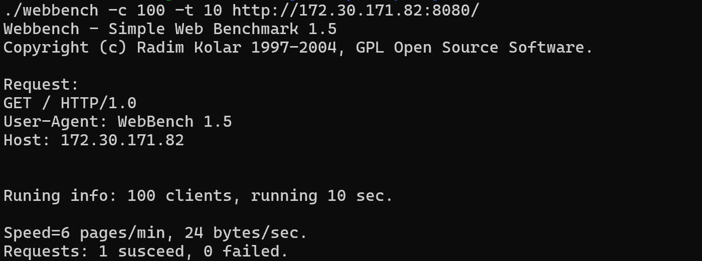

# TreeHoleServer

​		该项目是本人在学习Linux网络编程时独立开发的轻量级树洞服务器，项目主体是一个IO多路复用的Web服务器，在应用层上结合HTTP协议，使用POST和GET请求实现多用户留言和获取留言功能。

## 快速开始

```shell
# 编译
sh ./build.sh

# 服务端启动 (参数为：端口号、线程池内线程数量、跳表最大层数)
#./build/Debug/WebServer/WebServer <Port> <threadNum> <skiplistLevel>
./build/Debug/WebServer/WebServer 8080 4 10

# 客户端启动 (参数为：服务端IP、服务端端口、登录用户名)
#./build/Debug/WebServer/client/TreeHoleClient <IP> <Port> <username>
./build/Debug/WebServer/client/TreeHoleClient <IP> 8080 Sicrve
```

## 1. 项目展示
在[示例文档](./start.md)中，主要展示内容包括：
- 客户端登录展示
- 留言和获取留言界面及功能展示
- 服务端输出展示
- 日志系统输出展示
- 存储引擎持久化展示


## 2. 项目主要内容

​		该项目主要由服务器网络框架、应用层处理、存储引擎、日志系统四部分组成。

### 2.1 服务器网络框架

​		服务器网络框架采用主从Reactor+线程池的模型构建，实现One Loop Per Thread运行模式，采用边缘触发和非阻塞socket，支持多用户请求。支持长短链接，支持客户端主动关闭、服务器端超时关闭、错误关闭。

### 2.2 应用层

​		应用层上通过解析POST、GET请求并使用自定义数据流边界的方式实现留言和获取留言功能。

```c++
数据流边界:	^ @ ^
	POST: 	^key@number^
	GET:	^username@whisper^
```

### 2.3 存储引擎

​		存储引擎方面，采用跳表实现轻量级KV存储引擎，用于管理顺序留言数据，支持本地存储和读取功能。

### 2.4 日志系统

​		日志系统方面，借鉴双缓存技术分割日志场景中的生产者和消费者，结合写回线程实现异步日志系统。

## 3. 性能测试

​		测试环境：Ubuntu 22.04，AMD 7840HS，8G内存

### 3.1 网络压力测试：

​		服务器采用边缘触发模式，线程池大小为4，并发连接数100，所有访问均成功，QPS为3万+。


### 3.2 存储引擎测试：

​		使用单独的线程，对层级为10的跳表进行随机插入、查询测试，插入QPS为8万+，读取QPS为10万+。


## 4. 优化日记
对于服务器性能，目前考虑主要从三方面优化：
- 服务器连接请求处理流程优化
- 在HTTP响应处理层与存储引擎层之间引入缓存机制
- 改进新连接分配算法，尽可能实现负载均衡

### 4.1 服务器请求处理流程优化
原始服务器请求报文处理流程中，每个请求处理完后需要更新该连接的状态（定时器状态、监听事件状态等）。同时每个连接的关闭主要考虑：短连接断开、长连接超时、错误请求报文处理三方面处理。在之前的服务器框架中，处理逻辑较为繁琐，存在冗余现象，因此对其进行优化。  
通过将上述请求报文处理后的状态处理统一使用连接后处理函数进行处理，提高了处理效率，并在原测试环境下不仅提高了QPS的大小，还提高了并发连接数。


### 4.2 缓存机制
考虑到树洞服务器的资源是与时间挂钩的，因此采用LRU淘汰机制在请求处理层和存储引擎之间构建缓存机制，实现静态资源的快捷请求。   
LRU缓存结合哈希表（unordered_map）和双向链表来实现。为了减少链表的指针操作带来的问题，本项目采用数组（vector）实现静态双向链表。其中哈希表的key是请求文件名，value是请求回复报文的下标，通过这个下标可以在数组中找到对应的请求报文以及其在双链表中存在的位置。因此单次更新操作的时间复杂度为`O(1)`，代码详见[LRUCache.h](./WebServer/LRUCache.h)。  
优化后，进一步提高了QPS大小。


缓存机制优化过程中遇到的问题：缓存和存储引擎一样，在多线程条件下都是需要设置锁来避免并发问题，然而一开始在缓存接口函数`put`中的最开始加了锁（类似于全局锁），此时压力测试结果变得异常的差。

分析后怀疑是由于大量请求争抢锁导致了冲突，因此后续尽量缩减锁的作用范围，分不同情况进行加锁。


### 4.3 负载均衡
本项目的服务器框架由主从reactor+线程池的方式进行构建，因此主reactor接收到新的连接后以何种方式分配给从reactor也是可以改进的方案。  
常见的负载均衡算法有：
- 轮询法（Round Robin）
- 加权轮询法（Weight Round Robin）
- 随机法（Random）
- 最小连接数法（Least Connections）  
...

本项目原本使用轮训法，考虑到本项目线程池中每个线程都是一样的，因此加权轮询法和随机法的性能与轮训法相差不大，因此这里尝试实现最小连接数法对服务器进行优化。
```C++
EventLoop* EventLoopThreadPool::getLeastLoop() {
    baseLoop_->assertInLoopThread();
    assert(is_started);
    EventLoop* loop;
    int idx = 0;
    int cnt_socket = loops_[idx]->get_socket_num();
    
    for(int i = 0; i < numThreads_; i++) {
        int tmp = loops_[i]->get_socket_num();
        if(tmp < cnt_socket) {
            idx = i;
            cnt_socket = tmp;
        }
    }
    loop = loops_[idx];
    return loop;
}
```

结果显示，使用最小连接数算法进行负载均衡优化在网络压力测试中的改进幅度不是很大。可能由于WebBench其实是通过大量相同的短连接请求进行的测试，因此最小连接算法的负载均衡在这里的作用反而没有每次分配时循环带来的性能损耗大。

## 代码统计

​	共计 4221 行。

## Todo list

## todo list

- 服务器性能方面：增加内存池，实现内存复用。（学习了内存池原理，但是思考后感觉在服务器框架中没有太多内存的申请和释放操作，）

- 应用层功能方面：这个项目目前只实现了公共树洞，在之后打算新增多频道树洞功能，并对每个频道计算讨论热度等，类似于匿名微博。此外，考虑使用QT进行开发桌面应用。

## 参考内容

https://github.com/linyacool/WebServer/tree/master

https://github.com/qinguoyi/TinyWebServer

https://www.cnblogs.com/dogwealth/p/17938194

Linux高性能服务器编程，游双著.


